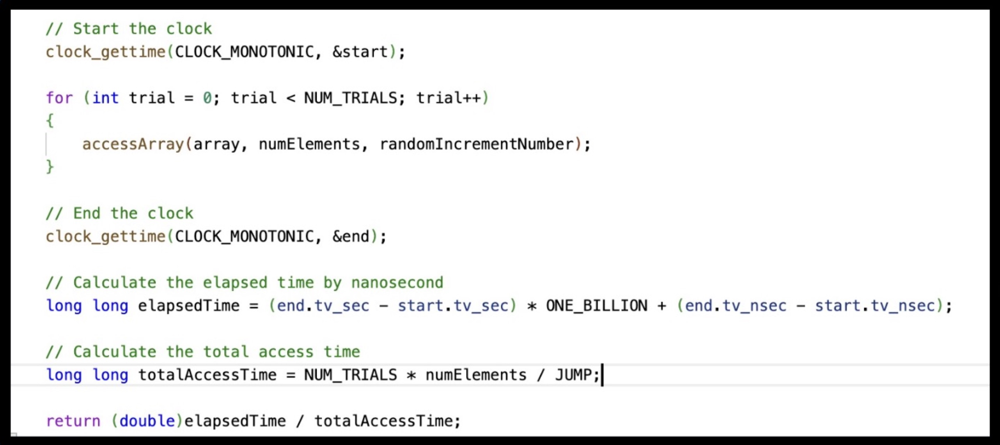

# Empirical Measurement for Translation Look-aside Buffer and Cache in Virtual Machine Mantis

**Dave Nguyen, Student, Carleton College, Tanya Amert, Professor, Carleton College**

**Abstract**—This paper presents a comprehensive study to measure empirically the Translation Look-aside Buffer (TLB) and cache sizes in modern CPUs. By developing a program that mimics the process of accessing elements, we will investigate the speed (performance) and size of both TLB and cache hierarchies (layers). The findings will allow us to have a deeper understanding of the behaviors of TLB and Cache, therefore, helping in the optimization of the program efficiency and speed.

## I. INTRODUCTION

The motivation embarked upon in this project is to acquire a comprehensive and detailed experiment into the empirical characterization and understanding of two of the most critical elements in the foundation of modern computing architectures: the Translation Lookaside Buffer (TLB) and the cache memory.

This knowledge is not merely academic; it is practical, enabling the optimization of software to utilize the full potential of existing hardware structure, which, for example, can be applied to High-Frequency Trading (HFT).

### Prerequisites

- A Unix-like operating system (Linux/MacOS)
- GCC compiler

#### Go to CacheSizeTest folder

```bash
cd CacheSizeTest
```

#### To generate data of speed vs array size

```bash
chmod +x run_cache.sh
./run_cache.sh
```

Then check the result in `cache_results.csv`

### To run the tests cases to check for correctness

```bash
chmod +x run_all_cache_tests.sh
./run_all_cache_tests.sh
```

### How to run TLB Test

After ssh to mantis

#### Go to TLBSizeTest folder

```bash
cd TLBSizeTest
```

#### To generate data of speed vs number of page

```bash
chmod +x run_tlb.sh
./run_tlb.sh
```

Then check the result in `tlb_results.csv`

### To run the tests cases to check for correctness

```bash
chmod +x run_all_tlb_tests.sh
./run_all_tlb_tests.sh
```

### Contact

If you come across any program, contact me through email: `nguyend2@carleton.edu`

## II. METHODOLOGY

This project employs a systematic approach to empirically measure the characteristics of cache memory and Translation look-aside buffers (TLB) in modern processors such as size or performance. Our methodology mimics the data access and time the access time per element in nanoseconds. Then we will graph the result and try to see for the "jump", which is when the access time suddenly rises. The "jump" can be considered as a potential boundary between layers of Cache or TLB.

We will specify the access frequency by a cache line (64B) or a page size (4kB)

**Time Measurement**: Precise measurement of access times is fundamental to our methodology. For this purpose, we use `clock_gettime(CLOCK_MONOTONIC)` function. This system call provides high-resolution timing information in nanoseconds. This is vital as the access time per element in the cache is so small that it can only be measured in nanoseconds. We capture start and end times before and after our test operations to calculate access times accurately. We need to make sure that we only calculate the time we access the array (after initialization or `malloc`,...).

Then to minimize any unexpected confounding factors, we need to measure the time in many trials, possibly from 100 to 10000 trials and take the average time access per element.

Here is the example code



- **Multiple CPUs**: Most systems today consist of multiple CPUs. Moreover, each CPU will have its own TLB hierarchy. Therefore, without any prevention, the scheduler can allow multiple CPUs to run. This will create fake access time, therefore, dismissing our results (Arpaci-Dusseau, 2015).

- **Implementation Mistake**: we might unintentionally put the data in the cache before we want to measure it. This dramatically reduces the measured access time as the data is already in the case.

Here is how we came up with different strategies to prevent this potential risk:

### Mitigating Compiler Optimizations

**Adding Random Elements**: We incorporate randomness into the memory access patterns to prevent the compiler from applying optimizations that could eliminate or alter the memory accesses we intend to measure. For example, accessing array elements based on a random index calculation can minimize the prefetching effect.

**Using Dummy Variables**: At the end of the file, we perform operations on dummy variables that involve data accessed during our tests and print it. This technique ensures that the compiler doesn’t change the memory access operations in the compiled code, as it acknowledges these operations as influencing the program’s output.

### Preventing Multicore Interference

Modern multicore systems can introduce incorrectness in measurements due to processes being scheduled on different cores. To prevent this, we need to restrict it to run only one specific core. This can be done easily through `set_cpu_affinity()`.

### Avoiding Unintentional Cache

To obtain accurate cache and TLB measurements, our tests must measure access times without the influence of data already present in the cache from prior operations. One of the mistakes, we made is to initialize the array with a random element first in the attempt to minimize the compiler optimization.

However, by doing this, we unintentionally put each element of the array in the cache before even measuring the access time. One solution to this is just to malloc the array without any initialization.

In general, we need to carefully design our measurement routines to avoid unnecessary access to the memory regions being tested before the actual measurement phase. This approach helps in preventing the unintentional "warming up" of the cache with our test data.


### Testing

- **Manual Testing**: to check if our program is giving the correct access time. We compared the average access time to the standard access time by cache to see if they were in an acceptable range. If they are out of the range, this indicates there is something wrong.

- **For automation testing**, we also implemented 5 test cases to make sure the code is working correctly. Here are some aspects that we test to make sure the time access to the large array is larger than a small array or ensure the code is accessing the correct number of times.

- **Cross Reference**: After achieving the size of the Cache, we cross-reference with our existing information of Cache Size in a virtual machine or Wikipedia’s information regarding the TLB size.

## III. EXPERIMENT

In this section, we delve into the results obtained from our empirical analysis of cache memory and Translation look-aside buffers (TLB), specifically in the virtual machine Mantis.


In Figure 3, we can see the jump happens at 4MB and 20MB. We interpreted the first jump as the L2 to L3 Cache layer jump as the L1 cache size is only a few kilobytes. And the 2nd jump is the end of the L3 cache. As we can see, since the 2nd jump, the access time becomes linear as it reaches the Random Access Memory (RAM). So we can guess the L3 size is around 20 - 4 = 16 MB.

Now we will look at a much smaller array size:


Here we can see that the biggest jump happened when the array size was 32kB (orange point). This suggested that the L1 cache is around 32KB. And this makes L2 cache 4 MB.

In conclusion, through empirical measurement, we calculated the L1, L2, and L3 sizes respectively, 32KB, 4MB, and 16MB. This is matched perfectly with the actual cache size of this virtual machine, which we know through the specification of Mantis.

Now, to measure TLB size, we will do the same but we will take the cache size into account.


In Figure 5, we see 2 jumps but the first jump is the jump we already know which is the L1 to L2 jump so the 2nd Jump around 16 Pages might be the L1 to L2 TLB Jump.


Similarly, we found out that the 2nd layer of TLB Jump might end at 1600 Pages.

Although we can’t find the actual size of TLB, we have some information about the TLB size of an intel chip, which states that L1 Layer of TLB might consist of up to 64 Page entries, while L2 layers might contain 1024 Page entries (Wikipedia, 2023). Although this information is not specifically for Mantis, it gives a considerably similar amount of pages.

One more thing we want to point out is that if we look at Figure 4, we can see that the access time takes a "mini jump" every 4kB, then becomes faster. This could be due to 2 reasons:

- **Prefetch Effect**: Modern processors attempt to guess which data will be needed next and load it into the cache in advance.

- Because 4kB is exactly the Page Size. The page is likely loading translation at each "mini-jump". That is why after the mini-jump the access time becomes faster.

So we can see the TLB and cache both affect the access time.

## IV. CONCLUSION

In this project, we have done a comprehensive exploration of cache memory and Translation look-aside buffers (TLB) within modern computer architectures, to explore their behavior and performance. We successfully determined the sizes of the Cache and delivered an acceptable result of TLB. Moreover, we were able to observe the intertwined effect between Cache and TLB or there exists a pre-fetching effect in modern computers when the access time makes periodic "mini jumps". Moreover, we have created a program that is scalable and applicable to run on other computers making it accessible to multiple users.

### Future Work

The project opens several opportunities for future work to enhance the understanding and optimization of computing systems. One potential area of exploration involves the deeper investigation of cache coherence mechanisms or effects of multicore processors in parallel computing.

Moreover, we also want to improve our measurement tools so that we can try with a multidimensional array instead of a 1D array to see if there are different behaviors.

Most importantly, we want to create an optimized access data approach so that we can both utilize the cache and TLB behaviors to access the data in minimum time. This can be extremely useful in high-frequency trading where 1 nanosecond can worth millions.

## V. REFERENCE

- Arpaci-Dusseau, Remzi H., and Andrea C. Arpaci-Dusseau. "Paging: Faster Translations (TLBs)." In Operating Systems: Three Easy Pieces, Chapter 19. Arpaci-Dusseau Books, 2015

- "Translation lookaside buffer." Wikipedia, The Free Encyclopedia, 2023. Accessed October 1, 2023.

- "Maurice Wilkes." Wikipedia, The Free Encyclopedia, 2023. Accessed October 1, 2023.

However, we need to consider some potential risks:

- **Compiler Optimization**: Compilers do many hidden clever things, for example removing loops that increment values that no other part of the program subsequently uses. So to measure the access time correctly, we need to ensure the compiler does not remove any code that we intended for it to run (Arpaci-Dusseau, 2015).

- **Multiple CPUs**: Most systems today consist of multiple CPUs. Moreover, each CPU will have its own TLB hierar-

## VI. APPENDIX

To understand the significance of and continue on this project, it’s essential to delve into the foundational concepts of cache memory and the Translation Lookaside Buffer (TLB), which are two of the most important elements in the architecture of modern processors. we will also proceed to explain what is a virtual machine where we test my project.

**Cache Memory**: Cache memory provides high-speed data access to a processor by storing instances of programs and data routinely accessed by the processor. As a result, cache memory reduces the time needed to access data from the main memory. One of the reasons why data from the cache can be accessed so fast is because the cache is located near the CPU. This difference in distance can dramatically diminish access times and reduce dependency on slower main memory, thereby accelerating the overall computing process.

The idea of cache memory can be traced back to the 1960s, with Maurice Wilkes’s concept of "slave memory". This earned him the Turing Award, which is considered one of the highest honors in computer science (Wikipedia, 2023).

Cache memory is organized into several levels (L1, L2, and L3) that vary in size, speed, and proximity to the CPU:

- **L1 Cache (Level 1)**: This is the smallest and fastest cache level, integrated directly into the processor chip. L1 cache stores instructions and data that are immediately required by the CPU, with typical sizes ranging from 2 KB to 64 KB and access time around 0.5 to 1.5 nanoseconds.

- **L2 Cache (Level 2)**: Slightly larger and slower than L1, but still operates at high speeds and is usually integrated into the CPU chip. It has sizes ranging from 256KB to several megabytes and access time is around 3 to 10 nanoseconds.

- **L3 Cache (Level 3)**: L3 cache is shared among all cores of the CPU to store data that are less frequently accessed. L3 cache sizes can range from 2MB to over 50MB with the access time around 10 to 40 nanoseconds.

When the CPU requests data, if the data is found in the cache (a cache hit), it can be accessed quickly. If the data is not in the cache (a cache miss), it must be fetched from the main memory, which takes more time.

We can maximize cache hits by understanding how computers store the data. In most computers, it stored the data in row-major order. In row-major order, elements of an array are stored row by row. Specifically, C (the language that we will use in this experiment) uses row-major order for multi-dimensional arrays.

For example, if we have a cache miss when accessing the 1st element, the elements from the 1st to 16th position will be put in the cache line.

**Translation Lookaside Buffer (TLB)**: The TLB is a special type of cache that stores recent translations of virtual memory addresses to physical addresses. The TLB operates on the principle of spatial and temporal locality, which means it stores the most recently and frequently used address translations.

When a virtual address needs to be translated, the TLB is queried first. If the translation is found, the physical address can be immediately used for data access. If the translation is not found (a "miss"), we need to look it up in the page table.

**Virtual Machine**: Virtual Machines are just like normal computers but they allow multiple operating systems to run concurrently on a single physical machine. Virtual Machine is an essential tool for efficient resource utilization, application testing, and system security.
